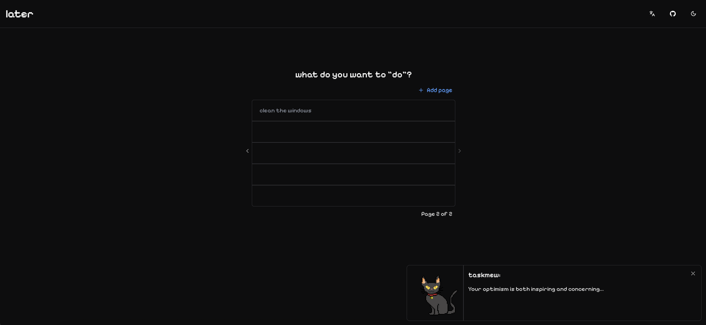
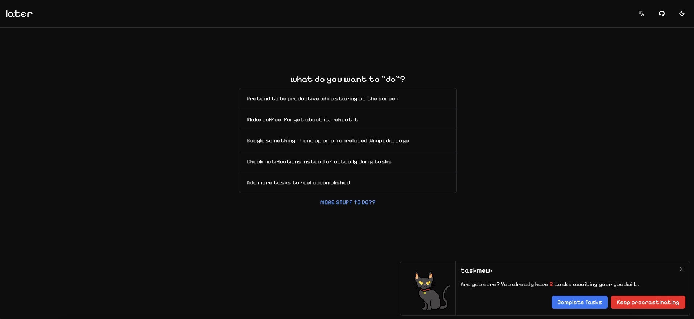

# Later

A playful task management app that embraces procrastination with a sarcastic cat companion named "Taskmeow".

## Screenshots

### First Access (Dark Theme)


### First Access (Light Theme)


### Task Management


### Multi-page Organization


### Cat Companion Dialog


## About

**Later** takes a different approach to productivity - instead of guilt-tripping users into getting things done, it provides a humorous, lighthearted experience for organizing tasks. The app features a witty cat character that delivers sarcastic commentary as you manage your to-do list.

## Features

- **Multi-page task organization** - Organize tasks across multiple pages (5 tasks per page)
- **Persistent storage** - Tasks automatically saved to localStorage
- **Cat companion** - Sarcastic feedback and witty messages throughout
- **Dark/Light themes** - Full theme support with system preference detection
- **Internationalization** - English and Portuguese language support
- **Accessibility-focused** - ARIA labels, keyboard navigation, screen reader support
- **Responsive design** - Mobile-first approach with Tailwind CSS

## Tech Stack

| Category | Technologies |
|----------|-------------|
| **Framework** | React 18, TypeScript, Vite |
| **Styling** | Tailwind CSS, Radix UI |
| **Forms** | React Hook Form |
| **i18n** | Inlang Paraglide |
| **Icons** | Lucide React, PixelArtIcons |
| **Linting** | Biome |

## Getting Started

```bash
# Install dependencies
npm install

# Start development server
npm run dev

# Build for production
npm run build

# Run linter
npm run lint
```

## Project Structure

```
src/
├── components/     # React components (cat-dialog, header, todo-list, etc.)
├── hooks/          # Custom hooks (use-todos, use-pagination, use-cat-events)
├── lib/            # Utilities and i18n configuration
├── constants/      # App constants and cat messages
├── types/          # TypeScript type definitions
└── assets/         # Static assets

messages/           # i18n translation files (en.json, pt.json)
```

## Contributing

Contributions are welcome! The codebase follows these patterns:

- **Components** use functional React with TypeScript
- **State management** handled via React Hook Form and custom hooks
- **Styling** uses Tailwind CSS utility classes
- **Translations** managed through Inlang Paraglide in `/messages`

## License

MIT
